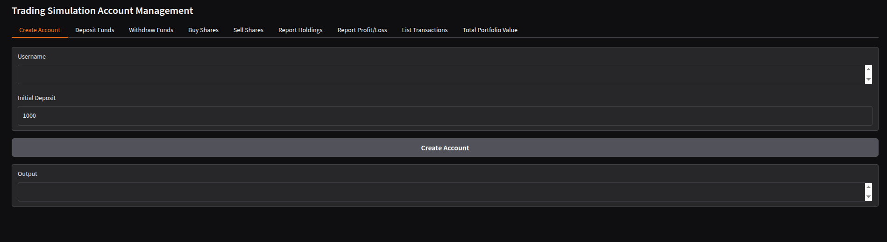

Welcome to the **Trading Account Management System**, a Python-based project built using **CrewAI**, a framework that orchestrates a team of AI agents to collaboratively develop software. This project simulates a stock trading account, allowing users to create accounts, deposit/withdraw funds, buy/sell shares, and track portfolio performance through a sleek Gradio-based web interface. It showcases how AI agents can act as an engineering team, handling everything from design to implementation and testing.

## Project Overview

This project demonstrates the power of **CrewAI** by simulating a development team consisting of:
- **Engineering Lead**: Designs the system with detailed function and method signatures.
- **Backend Engineer**: Implements a self-contained Python module (`accounts.py`) based on the design.
- **Frontend Engineer**: Builds a user-friendly Gradio UI (`app.py`) to interact with the backend.
- **Test Engineer**: Writes comprehensive unit tests (`test_accounts.py`) to ensure reliability.

The result is a fully functional trading account management system with the following features:
- Create a user account with an initial deposit.
- Deposit and withdraw funds with balance validation.
- Buy and sell shares of predefined stocks (AAPL, TSLA, GOOGL) using a mock pricing system.
- View portfolio holdings, total portfolio value, profit/loss, and transaction history.
- A clean, tab-based Gradio UI for intuitive interaction.
- Robust unit tests to validate backend functionality.

## Why CrewAI?

This project highlights the strength of **CrewAI** in coordinating multiple LLM-powered agents to mimic a real-world software development team. Each agent has a defined role, goal, and backstory, ensuring clear division of labor and high-quality output. The project serves as a proof-of-concept for using AI to streamline software development, from high-level design to production-ready code.

## Prerequisites

To run this project, you'll need:
- Python 3.8+
- [uv](https://github.com/astral-sh/uv) (a fast Python package and project manager)
- [Gradio](https://www.gradio.app/) for the web interface
- A basic understanding of Python and virtual environments

## Installation

1. **Clone the repository**:
   ```bash
   git clone https://github.com/royalrock11/The_Engineers.git
   cd The_Engineers
   ```

2. **Set up the virtual environment with uv**:
   ```bash
   uv venv
   source .venv/bin/activate  # On Windows: .venv\Scripts\activate
   ```

3. **Install dependencies**:
   ```bash
   uv pip install gradio
   ```

4. **Run the application**:
   ```bash
   uv run app.py
   ```
   This launches the Gradio UI in your browser, where you can interact with the trading account system.

5. **Run the unit tests** (optional):
   ```bash
   uv run python test_accounts.py
   ```

## Project Structure

```plaintext
The_Engineers/
├── pyproject.toml       # Project configuration for uv
├── README.md            # Project documentation
├── src/
│   ├── the_engineers/
│   │   ├── main.py      # CrewAI entry point
│   │   ├── crew.py      # CrewAI agent definitions
│   │   ├── config/
│   │   │   ├── agents.yaml  # Agent configurations
│   │   │   ├── tasks.yaml   # Task configurations
│   │   ├── output/
│   │   │   ├── accounts.py  # Backend module
│   │   │   ├── app.py       # Gradio UI
│   │   │   ├── test_accounts.py  # Unit tests
│   │   │   ├── accounts.py_design.md  # Design document
```

## Usage

1. **Launch the app**:
   Run `uv run app.py` to start the Gradio interface. It will open in your default browser.

2. **Interact with the UI**:
   - **Create Account**: Enter a username and initial deposit to start.
   - **Deposit/Withdraw Funds**: Add or remove funds from your account.
   - **Buy/Sell Shares**: Trade stocks (AAPL, TSLA, GOOGL) with mock prices.
   - **View Holdings**: Check your current stock holdings.
   - **Portfolio Value**: See the total value of your cash and stocks.
   - **Profit/Loss**: Track your financial performance.
   - **Transactions**: Review your transaction history.

3. **Run tests**:
   

## Screenshots

## Screenshots


## CrewAI Agents

The project leverages **CrewAI** to simulate a development team:
- **Engineering Lead**: Uses `gpt-4o-mini` to create a detailed design (`accounts.py_design.md`).
- **Backend Engineer**: Uses `grok/grok-3-mini-beta` to implement the `accounts.py` module.
- **Frontend Engineer**: Uses `grok/grok-3-mini-beta` to build the Gradio UI in `app.py`.
- **Test Engineer**: Uses `grok/grok-3-mini-beta` to write unit tests in `test_accounts.py`.

The `agents.yaml` file defines these roles, showcasing how CrewAI orchestrates AI agents to deliver a complete software solution.

## Future Improvements

- Add real-time stock price integration using an API (e.g., Alpha Vantage).
- Enhance the Gradio UI with charts for portfolio performance.
- Expand unit tests to cover edge cases and UI interactions.
- Deploy the app to a cloud platform for public access.

## Contributing

Contributions are welcome! Feel free to:
1. Fork the repository.
2. Create a feature branch (`git checkout -b feature/YourFeature`).
3. Commit your changes (`git commit -m 'Add YourFeature'`).
4. Push to the branch (`git push origin feature/YourFeature`).
5. Open a pull request.

Please ensure your code follows PEP 8 and includes unit tests where applicable.

## License

This project is licensed under the MIT License. See the [LICENSE](LICENSE) file for details.

## Acknowledgments

- **CrewAI**: For providing an awesome framework to coordinate AI agents.
- **Gradio**: For enabling a quick and easy web interface.
- **xAI**: For powering the Grok-based agents (`grok/grok-3-mini-beta`).
- **You**: For checking out this project! 🚀

---

Built with ❤️ by Reggie using **CrewAI**. Star this repo if you find it useful!
